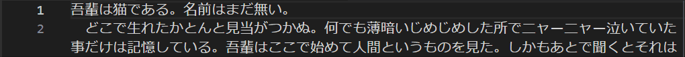
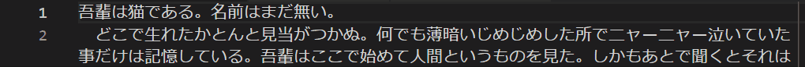

# Japanese Word Handler

&nbsp;

Better cursor movement in Japanese text for [VS Code](https://code.visualstudio.com).

## How to activate the logic?

Just install the extension. Doing so changes the action for the keybindings
below:

* <kbd>Ctrl+Right</kbd> (or <kbd>Option+Right</kbd> on OSX)
* <kbd>Ctrl+Left</kbd> (or <kbd>Option+Left</kbd> on OSX)
* <kbd>Ctrl+Shift+Right</kbd> (or <kbd>Option+Shift+Right</kbd> on OSX)
* <kbd>Ctrl+Shift+Left</kbd> (or <kbd>Option+Shift+Left</kbd> on OSX)

This extension does not add any command to the command platte.

## What's the difference from the original?

With the original logic, pressing <kbd>Ctrl+Right</kbd> while the cursor is at
the beginning of a chunk of Japanese characters will move the cursor to the end
of it.

With this extension, on the other hand, the cursor will stop at each place
where the Japanese character type (Hiragana, Katakana, ...) changes.

## Known limitations

As of VSCode 1.27, extension cannot override word related actions below:

* Word selection on double click
* Automatic highlight of a word at where the cursor is
* 'Match Whole Word' option of text search

## Issue report

Please visit the [project's GitHub page](https://github.com/sgryjp/japanese-word-handler) and .

**Enjoy!**
